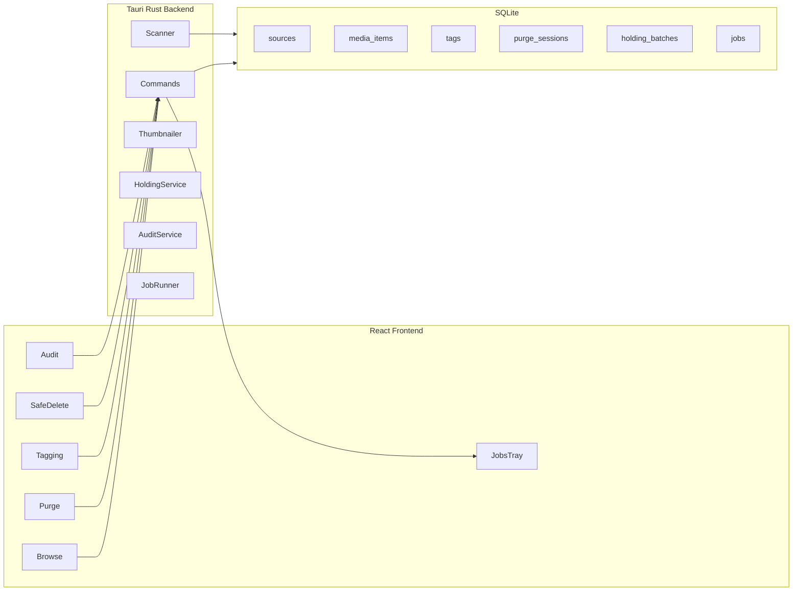

# Media Master v2 — Implementation Architecture

## Overview

Media Master v2 is a Tauri v2 desktop application with a React + TypeScript frontend and a Rust backend backed by SQLite. The architecture separates **UI modes** (React feature components), **IPC commands** (Tauri invoke handlers), and **services** (scanner, thumbnailer, holding, audit, job runner).



## Stack

| Layer | Technology |
|-------|------------|
| Shell | Tauri v2 |
| Frontend | React 18, TypeScript, Vite |
| State | Zustand (domain stores) |
| Backend | Rust |
| Database | SQLite via `rusqlite` |
| Serialization | `serde` + `serde_json` |
| Media | FFmpeg/FFprobe (detected local binaries), `image` crate for thumbnails |
| Platform | Windows-first |

> **Note:** An earlier architecture draft referenced Vue + Pinia. The implemented v1 uses React + Zustand with equivalent store boundaries.

## Folder layout

```
src/
  app/
    App.tsx                 # Shell, mode router, startup init
    main.tsx
  components/
    shell/                  # TopBar, Sidebar, RightPanel, JobTray
    media/                  # MediaGrid, MediaTile
    shared/                 # Kbd, TagChip, Toast
  features/
    browse/                 # BrowseMode
    purge/                  # PurgeMode
    tagging/                # TaggingMode
    safe-delete/            # SafeDeleteMode
    audit/                  # AuditMode
  lib/
    tauri.ts                # Typed invoke wrappers
    types.ts                # Shared TS types (mirror Rust models)
    mockData.ts             # Mock catalog until scan wired
  stores/
    appStore.ts             # mode, toast, db/ffmpeg status
    libraryStore.ts         # sources, items, selection, filters
    purgeStore.ts           # session, index, undo
    jobsStore.ts            # operations queue
  styles/
    tokens.css              # CSS variables (from mockup)
    app.css                 # Layout + component styles

src-tauri/
  src/
    lib.rs                  # Tauri builder, command registration, DB setup
    main.rs
    models.rs               # Shared Rust structs + enums
    commands/
      scan.rs               # add_source, scan_source, list_sources
      media.rs              # list_media, get_media_item, update_media_state
      tags.rs               # create_tag, assign_tags, list_tags
      purge.rs              # start/mark/undo/finish session
      safe_delete.rs        # preview, move, restore holding batches
      audit.rs              # run_media_audit, list_audit_findings
      jobs.rs               # list_jobs
      ffmpeg.rs             # detect_ffmpeg
      settings.rs           # get_settings, set_setting
    db/
      mod.rs                # Database wrapper, query helpers
      migrations.rs         # Run embedded SQL migrations
    services/
      scanner.rs            # Recursive walk, upsert media_items
      thumbnailer.rs        # Image resize + FFmpeg frame extract
      safe_delete.rs        # Holding move/restore logic
      audit.rs              # Query-based finding generation
      ffmpeg.rs             # Binary detection (PATH + common Windows paths)
      job_runner.rs         # Single-thread job queue
  migrations/
    0001_initial.sql        # All v1 tables + indexes
```

## Database

**Location:** `{app_data_dir}/media_master.db`

**Initialization:** Open on Tauri `setup`, run migrations before serving commands.

**Media ID strategy:** `SHA256(normalized_absolute_path)` truncated to hex string — stable across rescans unless path changes.

**Thumbnail cache:** `{app_cache}/thumbs/{media_id}_{modified_at}.jpg` — invalidated when file mtime changes.

### Schema summary

See [MEDIA_MASTER_V2_SPEC.md](./MEDIA_MASTER_V2_SPEC.md) for column-level detail. Tables:

- `sources`, `media_items`, `tags`, `media_tags`
- `purge_sessions`, `purge_decisions`
- `safe_delete_batches`, `safe_delete_items`
- `jobs`, `app_settings`

Indexes on `media_items(source_id)`, `media_items(purge_state)`, `media_tags(tag_id)`, `jobs(status)`.

## IPC command surface

All frontend calls go through typed wrappers in `src/lib/tauri.ts` using `@tauri-apps/api/core` `invoke`.

| Area | Commands |
|------|----------|
| Sources | `add_source`, `remove_source`, `list_sources` |
| Scan | `scan_source` (async, emits `scan:progress`) |
| Media | `list_media`, `get_media_item`, `update_media_state` |
| Thumbs | `get_thumbnail_path` (lazy generate + cache) |
| Purge | `start_purge_session`, `mark_purge_decision`, `undo_purge_decision`, `finish_purge_session`, `list_rejects` |
| Tags | `create_tag`, `rename_tag`, `list_tags`, `assign_tags`, `remove_tags`, `set_tag_hotkey` |
| Safe Delete | `preview_holding_move`, `move_to_holding`, `list_holding_batches`, `restore_holding_batch`, `final_delete_holding_batch` |
| Audit | `run_media_audit`, `list_audit_findings`, `dismiss_audit_finding` |
| Jobs | `list_jobs` |
| FFmpeg | `detect_ffmpeg` |
| Settings | `get_settings`, `set_setting` |
| DB | `get_db_status` |

### Events (subscribed on startup)

| Event | Payload |
|-------|---------|
| `scan:progress` | `{ sourceId, scanned, total, currentPath }` |
| `media:added` | `{ itemId }` |
| `media:updated` | `{ itemId }` |
| `job:progress` | `{ jobId, progress }` |
| `job:done` | `{ jobId }` |
| `purge:updated` | `{ sessionId }` |
| `tags:updated` | `{}` |
| `holding:updated` | `{ batchId }` |
| `audit:updated` | `{}` |

## Shared types

Rust (`models.rs`) and TypeScript (`types.ts`) mirror these core types:

- `MediaItem`, `Source`, `Tag`
- `PurgeState`: `unreviewed` | `keep` | `reject` | `maybe`
- `PurgeSession`, `PurgeSummary`, `PurgeUndoEntry`
- `HoldingBatch`, `HoldingPreview`, `HoldingBatchStatus`
- `AuditFinding`, `AuditFindingKind`, `AuditSeverity`, `SuggestedAction`
- `Job`, `JobKind`, `JobStatus`
- `MediaFilter`, `MediaPage`, `MediaPatch`
- `FfmpegInfo`, `DbStatus`
- `AppMode`: `browse` | `purge` | `tagging` | `safe_delete` | `audit`

## Service boundaries

### Scanner (`services/scanner.rs`)

- Recursive `walkdir` over source path
- Filter by extension whitelist
- Upsert `media_items`; skip if path + `modified_at` unchanged
- Emit progress every N files
- Run on background thread; batched SQLite writes

### Thumbnailer (`services/thumbnailer.rs`)

- **Images:** `image` crate resize to ~256px max edge → JPEG cache
- **Videos:** FFmpeg single-frame extract when binary available; else gradient placeholder
- Return cache path for `convertFileSrc` in frontend

### Holding service (`services/safe_delete.rs`)

- **Preview:** List rejects not in holding; sum bytes; show target roots
- **Move:** `{sourceRoot}/_MediaMaster_Holding/{timestamp}/` + relative path
- **Conflict naming:** Append `_1`, `_2` on collision
- **Restore:** Reverse move to `original_path`
- **Final delete:** Stub returns error in v1

### Audit service (`services/audit.rs`)

- Query-only findings (no perceptual hashing in v1)
- Thresholds from `app_settings`
- Returns `AuditFinding[]` with `suggested_action` for navigation

### Job runner (`services/job_runner.rs`)

- Simple queue: one active job at a time
- Persists to `jobs` table
- Emits progress/done events
- v1 kinds: `holding_move`, `holding_restore`, `ffprobe_scan`

### FFmpeg service (`services/ffmpeg.rs`)

- Detect on PATH + common Windows install locations
- Store override in `app_settings`
- Expose version string for top-bar pill

## Frontend architecture

### Mode routing

No React Router. `appStore.mode` selects which feature component renders in `<main>`:

```tsx
{mode === "browse" && <BrowseMode />}
{mode === "purge" && <PurgeMode />}
// ...
```

### Zustand stores

| Store | Responsibility |
|-------|----------------|
| `appStore` | `AppMode`, toast, DB path, FFmpeg label |
| `libraryStore` | sources, tags, items, selection, search, filters |
| `purgeStore` | session item list, index, decisions, undo stack |
| `jobsStore` | operations queue rows |

### Component hierarchy

```
App
├── TopBar          (brand, search, mode buttons, FFmpeg pill)
├── Sidebar         (sources, tags, purge counts, holding)
├── main
│   └── *Mode       (Browse | Purge | Tagging | SafeDelete | Audit)
├── RightPanel      (inspector / mode-specific sidebar)
├── JobTray         (operations queue)
└── Toast
```

## Key technical decisions

| Decision | Choice | Rationale |
|----------|--------|-----------|
| Frontend | React + TS | User preference over Vue draft |
| State | Zustand | Lightweight; mirrors Pinia boundaries |
| Holding location | Per source root | Keeps batches near original files; easy manual inspection |
| Thumbnail key | `{id}_{modified_at}` | Auto-invalidate on file change |
| Scan concurrency | Background thread + batched upserts | Avoid blocking UI on 10k+ files |
| Permanent delete | Disabled | Safety-first v1 checkpoint |
| Audit persistence | Computed on demand | Avoid stale finding tables; defer `audit_findings` table |
| Pagination | 200 items/page | Large library performance |

## Security & filesystem

- All file operations use absolute paths validated against registered sources
- Holding moves never cross source roots in a single batch (v1)
- No network calls required for core workflows
- Tauri capabilities: `dialog` (folder picker), `opener` (reveal in Explorer)

## Build & dev

```bash
npm install
npm run tauri dev      # Development
npm run tauri build    # Production bundle
```

Rust dependencies (key): `tauri`, `rusqlite`, `serde`, `serde_json`, `uuid`, `sha2`, `walkdir`, `tokio`, `image`.

## Implementation slices

Work proceeds in vertical slices; each slice leaves the app launchable:

| Slice | Deliverable |
|-------|-------------|
| 0 | Scaffold + mockup shell + mode switching |
| 1 | SQLite + migrations + stub commands |
| 2 | Source registration + scanner |
| 3 | Thumbnails + browse grid + inspector |
| 4 | Purge session + keyboard UI |
| 5 | Tag CRUD + tagging mode |
| 6 | Holding move + restore |
| 7 | Audit dashboard |
| 8 | Job runner + FFmpeg detect |
| 9 | Polish (empty states, toasts, icon) |

See [MEDIA_MASTER_V2_SPEC.md](./MEDIA_MASTER_V2_SPEC.md) for acceptance criteria per slice.

## Mockup reference

The HTML mockup at [media-master-v2-mockup.html](./media-master-v2-mockup.html) is the visual source of truth for:

- CSS grid shell dimensions (260 / 340 / 128px)
- Color tokens and typography
- Mode layouts and keyboard hint bars
- Component naming conventions ported to React

When implementing UI, match mockup spacing and tokens before adding new patterns.
